# Kinderarbeit

Aufgaben, Taschengeld und Konto für die ganze Familie –
auf einer eigenen kleinen Seite.

Eltern stellen Aufgaben mit einem Betrag ein, die Kinder haken sie ab,
die Eltern bestätigen sie einmal, und erst dann wird der Betrag dem Konto
des Kindes gutgeschrieben. Dazu kommen regelmäßige Ausgaben, eine
vollständige Historie und der Restbetrag pro Monat.

## Überblick

| Bereich | Wer | Was |
|---|---|---|
| Anmeldung | alle | Profil antippen und PIN eingeben – oder persönlichen Zugangslink öffnen |
| Aufgaben | Kinder | offene Aufgaben sehen und als erledigt melden |
| Mein Konto | Kinder | Guthaben, Monatsübersicht, laufende feste Ausgaben, alle Buchungen |
| Verlauf | Kinder | eigene Meldungen mit Status |
| Übersicht | Eltern | **Wiedervorlage**: melden bestätigen oder ablehnen |
| Aufgaben | Eltern | Aufgaben anlegen, Betrag festlegen, zuweisen, pausieren |
| Kinder | Eltern | Konten im Vergleich, Detailseite je Kind |
| Ausgaben | Eltern | regelmäßige monatliche Ausgaben je Kind |
| Verlauf | Eltern | alle Buchungen, filterbar nach Kind und Monat – hier lassen sie sich auch ändern und löschen |
| Familie | Eltern | Zugangslinks, PINs, Sperren, Symbole, Farben, angemeldete Geräte |
| Benachrichtigungen | alle | pro Gerät ein- und ausschaltbar, direkt auf der Startseite |

## So sieht es aus

Alle Bilder stammen aus dem Beispielbestand (`php bin/demo-data.php --force`) –
echte Namen, erfundene Beträge und Handynummern. Die Anwendung ist fürs Handy
gebaut, deshalb sind die meisten Aufnahmen in Handybreite. Neu aufnehmen lassen
sie sich mit `docs/bilder-aufnehmen.mjs` (braucht Node und Playwright und
gehört ausdrücklich nicht zur Anwendung).

### Hinein kommt man auf zwei Wegen

| | |
|---|---|
| 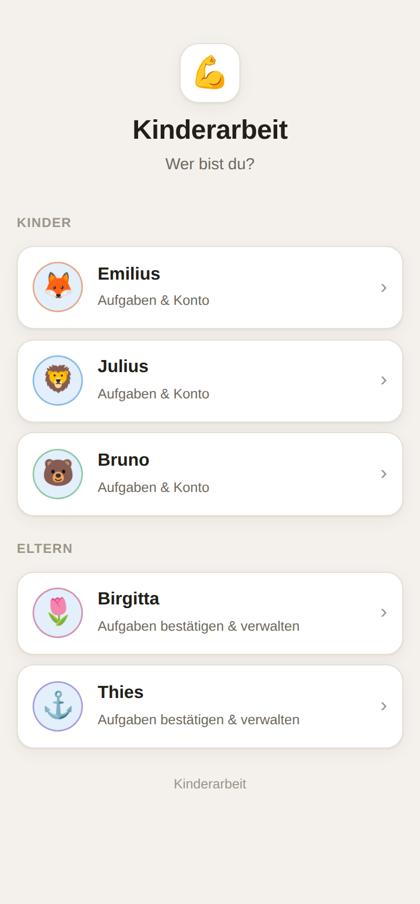<br>**Wer bist du?** Profil antippen – Kinder oben, Eltern darunter. Jedes Profil hat ein eigenes Symbol und eine eigene Farbe, die sich durch die ganze Anwendung zieht. | 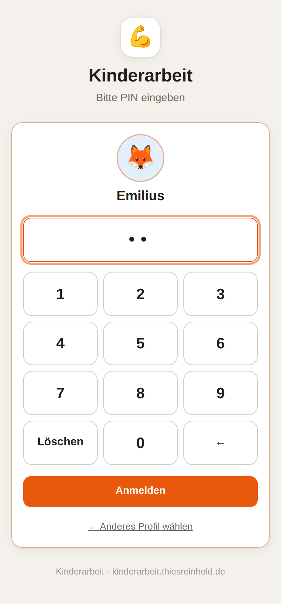<br>**PIN eingeben.** Großer Zifferblock, damit es auch mit Kinderfingern klappt. Nach fünf Fehlversuchen ist das Profil zehn Minuten gesperrt. Wer den persönlichen Zugangslink hat, überspringt diesen Schritt ganz. |

### Für die Kinder

| | |
|---|---|
| 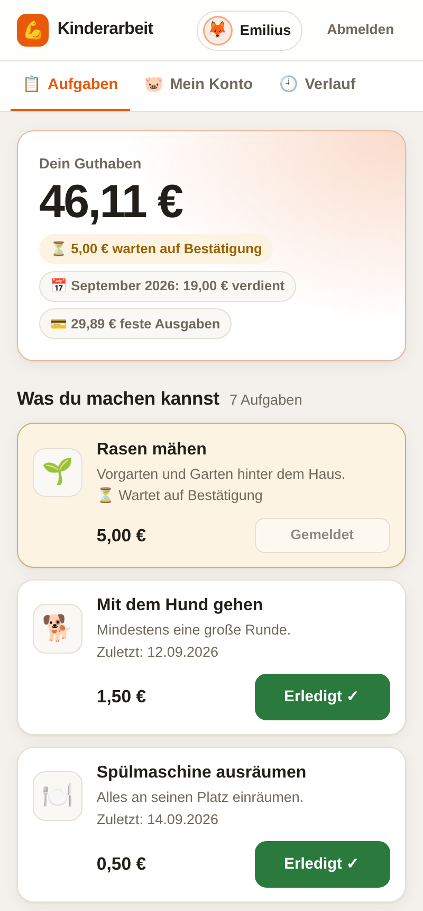<br>**Was du machen kannst.** Oben das Guthaben, darunter alle offenen Aufgaben mit Betrag. Ein Tipp auf „Erledigt ✓“ meldet sie den Eltern – gemeldete Aufgaben sind ausgegraut und warten. | 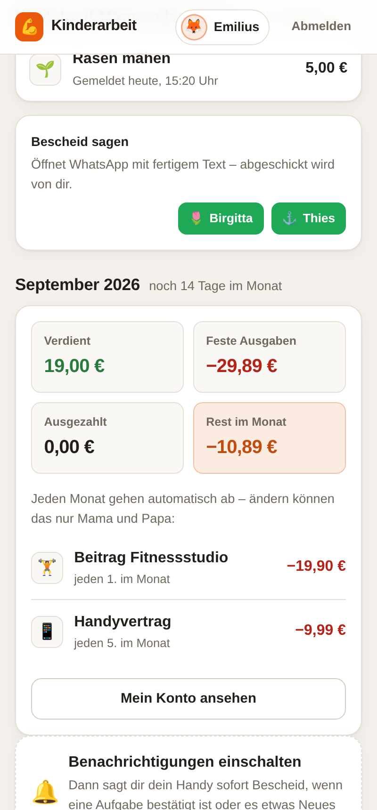<br>**Bescheid sagen.** Wartet etwas auf Bestätigung, kann das Kind Mama oder Papa mit einem Tipp per WhatsApp erinnern. Der Text ist fertig vorbereitet, abgeschickt wird von Hand. |
| 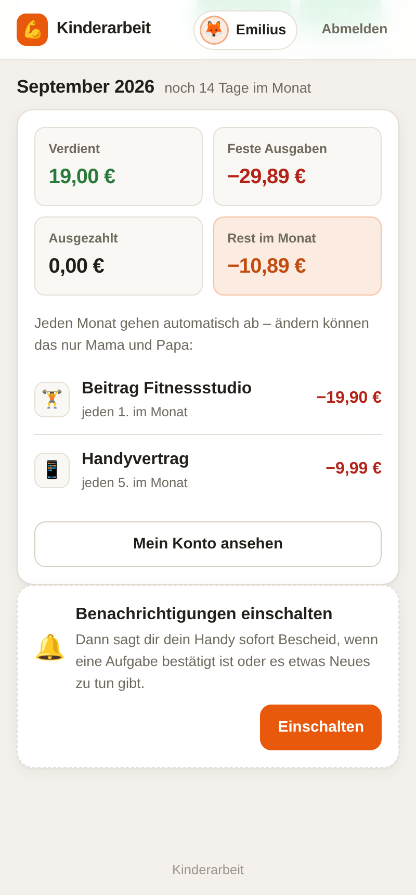<br>**Der Monat auf einen Blick.** Verdient, feste Ausgaben, ausgezahlt – und der **Rest im Monat**. Die vier Kacheln gehen immer auf; darunter steht, was automatisch abgeht. | 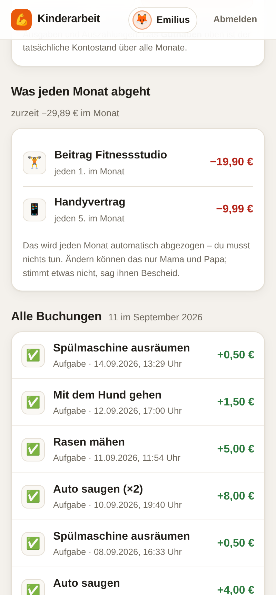<br>**Mein Konto.** Oben, was jeden Monat fest abgeht – zum Nachlesen, nicht zum Ändern. Darunter jede einzelne Buchung, neueste zuerst, mit Datum und Herkunft. Eine zurückgenommene Bestätigung steht als eigene Gegenbuchung drin; was die Eltern nachträglich ändern, ist als „geändert“ gekennzeichnet. |
| 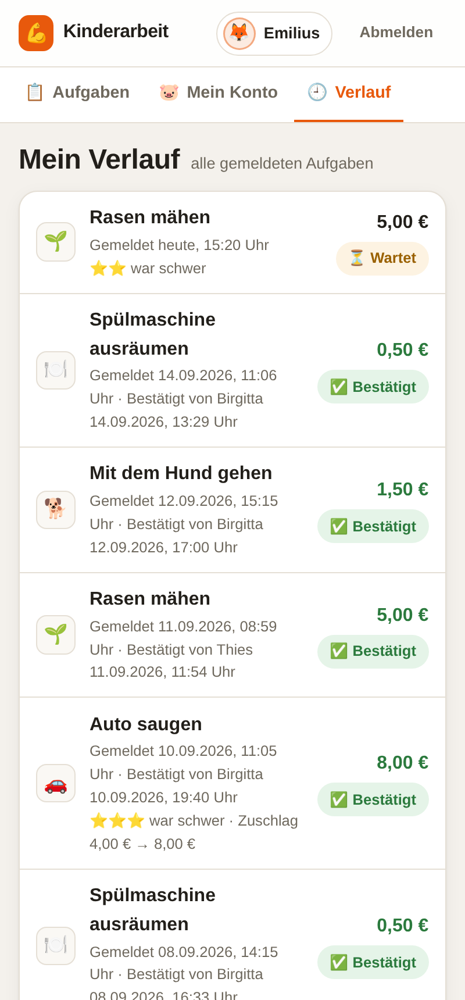<br>**Mein Verlauf.** Alle gemeldeten Aufgaben mit ihrem Stand: wartet, bestätigt oder abgelehnt – samt Uhrzeit und dem Elternteil, das entschieden hat. | 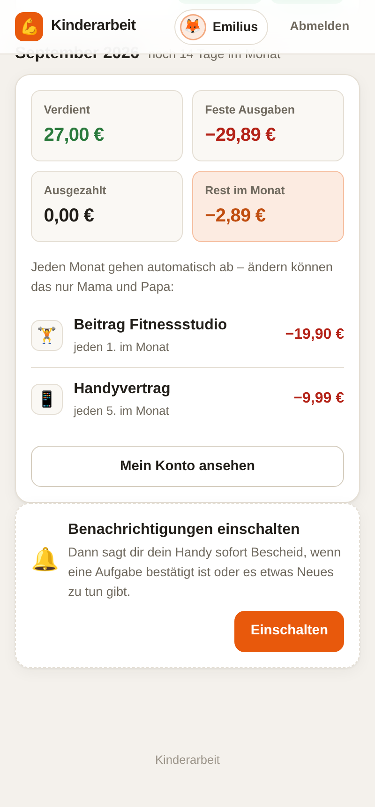<br>**Benachrichtigungen einschalten.** Pro Gerät ein Tipp. Danach meldet sich das Handy, sobald eine Aufgabe bestätigt ist oder es etwas Neues zu tun gibt – auch bei geschlossener Seite. |

### Für die Eltern

| | |
|---|---|
| 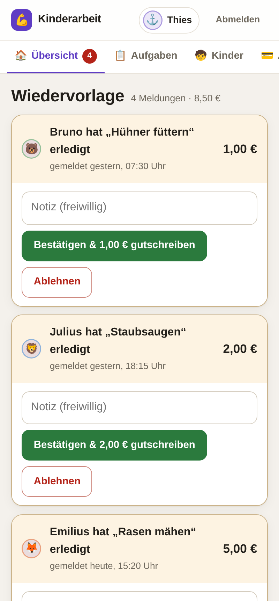<br>**Wiedervorlage.** Alles, was die Kinder gemeldet haben, wartet hier. Bestätigen schreibt den Betrag gut, Ablehnen nicht. Die Notiz ist freiwillig und landet im Verlauf des Kindes. | 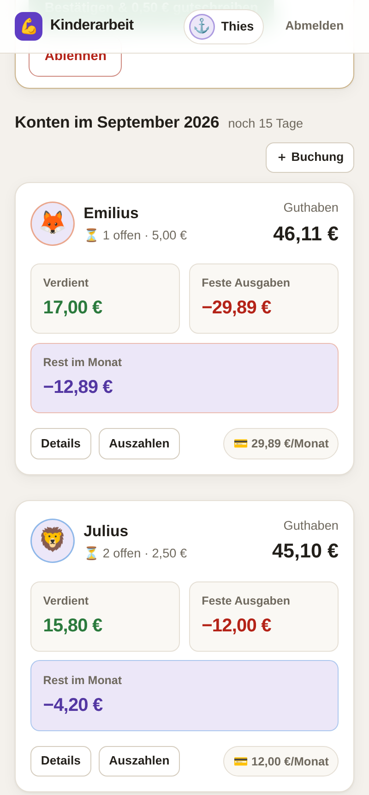<br>**Konten im Monat.** Je Kind Guthaben, Verdientes, feste Ausgaben und Rest – dazu die Abkürzungen zu Auszahlung und Details. |
| 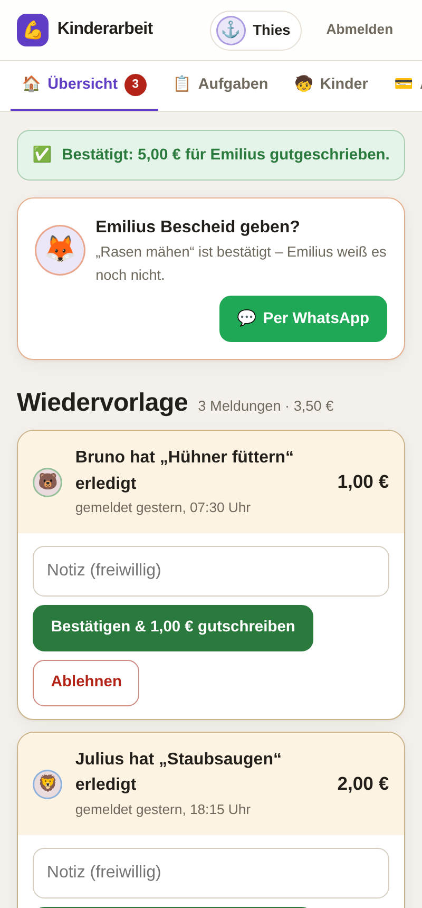<br>**Nach dem Bestätigen.** Der Betrag ist gutgeschrieben. Hat das Kind noch keine Benachrichtigung an, bietet die Seite einmalig an, ihm per WhatsApp Bescheid zu geben – mit Betrag und neuem Guthaben im Text. | 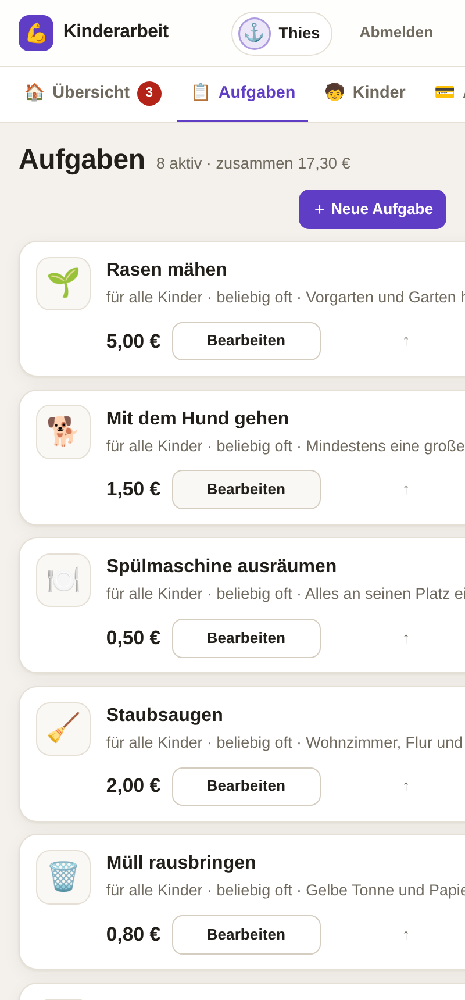<br>**Aufgaben verwalten.** Anlegen, bearbeiten, pausieren, sortieren. Eine Aufgabe mit Historie wird beim Löschen nur pausiert, damit alte Buchungen nachvollziehbar bleiben. |
| 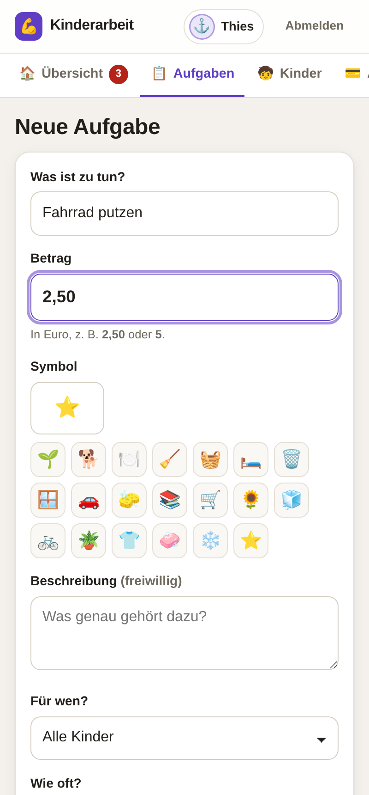<br>**Neue Aufgabe.** Name, Betrag, Symbol aus der Auswahl, freiwillige Beschreibung – und für wen sie gilt: für alle Kinder oder für ein bestimmtes. | 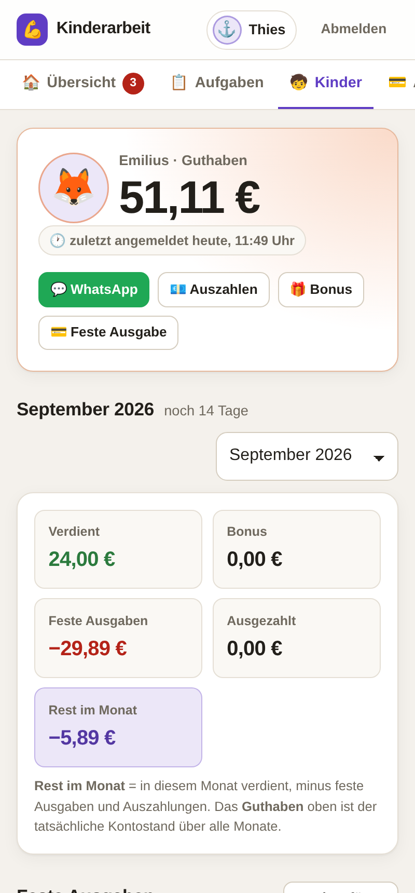<br>**Detailseite eines Kindes.** Guthaben, offene Meldungen, Monatsübersicht und alle Buchungen an einer Stelle – dazu der WhatsApp-Knopf für eine Nachricht zwischendurch. |
| 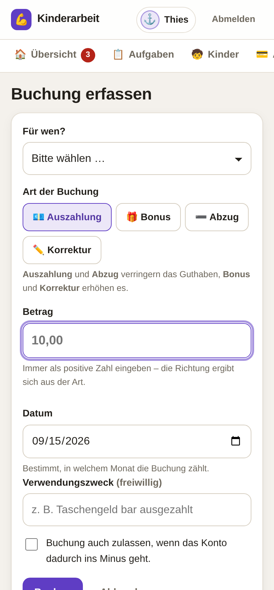<br>**Buchung erfassen.** Auszahlung, Bonus, Abzug oder Korrektur. Beträge immer positiv eingeben – die Richtung ergibt sich aus der Art, das Datum entscheidet über den Monat. Ein Haken erlaubt ausdrücklich, das Konto ins Minus zu buchen. Dasselbe Formular dient zum Bearbeiten. | 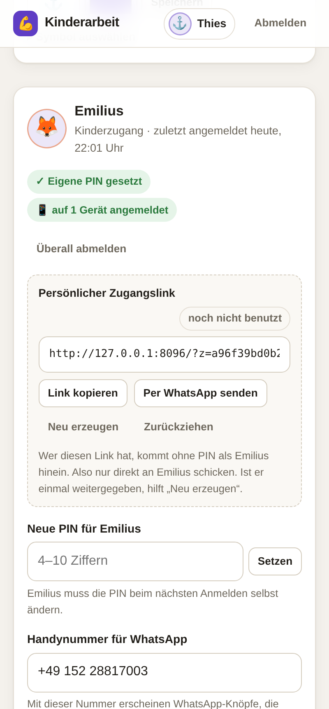<br>**Familie.** Persönlicher Zugangslink zum Kopieren oder direkt per WhatsApp, PIN neu setzen, Handynummer, Symbol und Farbe – und wie viele Geräte gerade angemeldet sind. |

### Auf dem Rechner ist mehr Platz

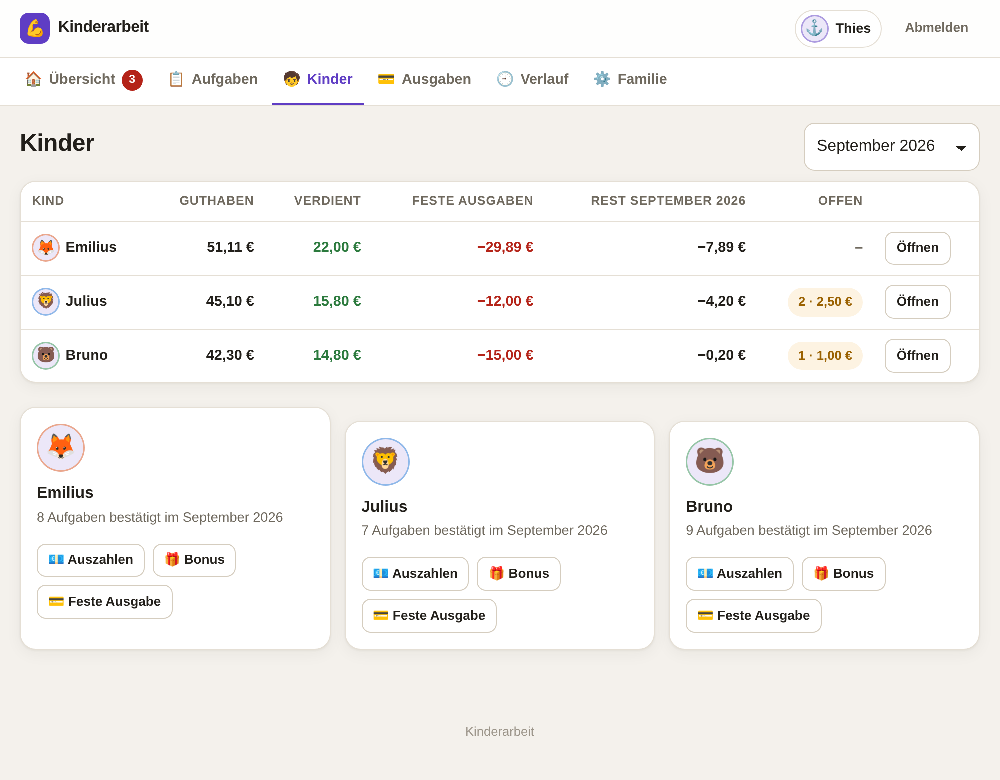

**Kinder im Vergleich.** Alle Konten nebeneinander, umschaltbar auf jeden vergangenen Monat.

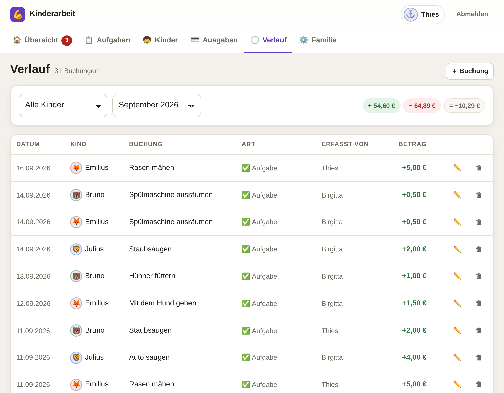

**Verlauf.** Sämtliche Buchungen, filterbar nach Kind und Monat, mit den Summen des Zeitraums über der Tabelle. Rechts an jeder Zeile: ✏️ bearbeiten und 🗑 löschen – auf dem Handy bleibt die Spalte beim seitlichen Scrollen stehen.

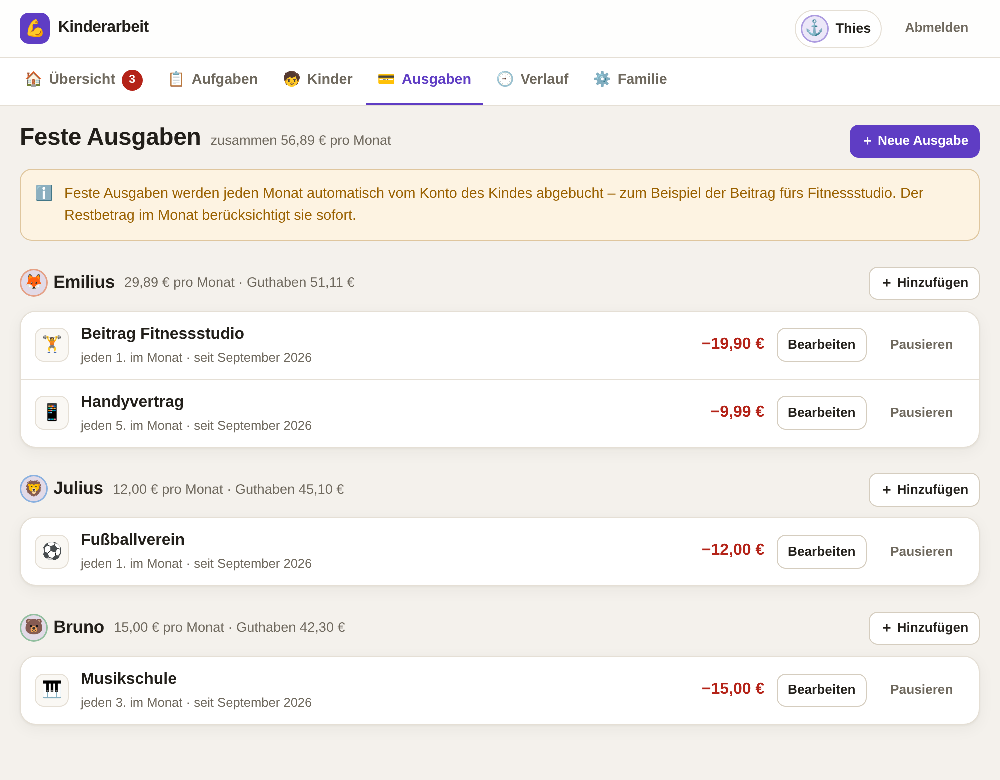

**Feste Ausgaben.** Beitrag, Buchungstag und ab wann – gebucht wird automatisch beim ersten Seitenaufruf des Tages, ganz ohne Cronjob.

### Hell und dunkel

Die Anwendung übernimmt die Einstellung des Geräts. Es gibt nichts umzuschalten.

| | |
|---|---|
| 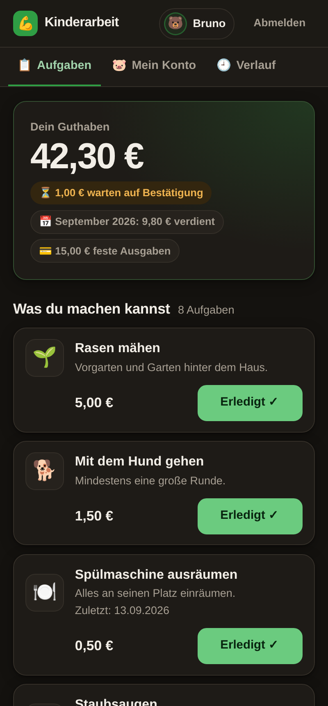<br>**Kinderbereich im dunklen Design.** | 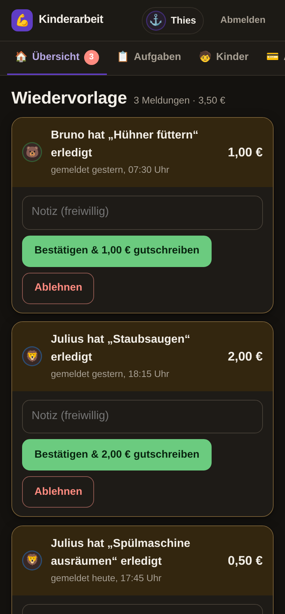<br>**Elternbereich im dunklen Design.** |

## Die Familie

Beim ersten Start werden fünf Profile angelegt:

| Profil | Rolle | Start-PIN |
|---|---|---|
| Emilius | Kind | `1111` |
| Julius | Kind | `2222` |
| Bruno | Kind | `3333` |
| Birgitta | Eltern | `4444` |
| Thies | Eltern | `5555` |

Beim ersten Anmelden muss jede und jeder eine eigene PIN setzen –
die Start-PINs funktionieren also genau einmal.

## Persönliche Zugangslinks

Wer keine PIN tippen mag, bekommt von den Eltern einen eigenen Link:

```
https://eure-adresse.de/?z=1d1a952f7a3c4e0b8f6d2a91c5e7b403
```

Die Eltern erzeugen ihn unter **Familie**, kopieren ihn mit einem Klick oder
schicken ihn direkt über WhatsApp. Wer den Link öffnet, ist sofort angemeldet
und wird nicht nach der PIN gefragt; der Token verschwindet dabei aus der
Adresszeile.

**Der Link wird nur einmal gebraucht.** Danach genügt die blanke Adresse –
das Gerät bleibt angemeldet.

* Der Token ist 128 Bit lang und damit nicht zu erraten.
* Ein Link gilt, bis er neu erzeugt oder zurückgezogen wird – er läuft nicht ab.
* „Neu erzeugen“ macht den bisherigen Link sofort ungültig **und meldet die
  damit angemeldeten Geräte ab**. Das ist der Weg, wenn ein Link in falsche
  Hände geraten ist.
* Die Rechte bleiben dieselben: ein Kind, das über seinen Link hereinkommt,
  sieht weiterhin nur den eigenen Bereich.
* Wer den Link eines Elternteils hat, hat Zugriff auf den gesamten
  Elternbereich – solche Links also nur direkt an Birgitta oder Thies schicken.
* Die Anwendung merkt sich, wann ein Link zuletzt benutzt wurde.

Solange jemand ausschließlich den Link nutzt, bleibt die Start-PIN gültig.
Deshalb lohnt es sich, unter **Familie** trotzdem einmal eine eigene PIN zu setzen.

## Angemeldet bleiben

Wer sich einmal angemeldet hat – per PIN oder per Link –, bleibt es: ein Jahr
lang, je Gerät und Browser. Die Seite fragt danach weder nach PIN noch nach
Link.

Die PHP-Sitzung allein reicht dafür nicht. Ihr Cookie hält zwar 30 Tage, die
Sitzungsdatei auf dem Server räumt PHP aber schon nach 24 Minuten Untätigkeit
weg (`session.gc_maxlifetime`), und auf geteiltem Webhosting leeren fremde
Aufräumläufe dasselbe Verzeichnis mit. Wer abends den Link bekommt, wäre am
nächsten Morgen wieder draußen. Deshalb gibt es ein eigenes Cookie mit eigenem
Token (`app/Remember.php`): Kommt jemand ohne Sitzung, aber mit gültigem Token,
wird die Sitzung stillschweigend neu aufgebaut.

* Das Cookie enthält `selector:validator`. Gesucht wird über den selector,
  verglichen wird der validator gegen seinen SHA-256-Hash – wie beim PIN-Hash
  nützt ein Blick in die Datenbank niemandem etwas.
* Jedes Gerät hat seinen eigenen Token. Unter **Familie** steht je Profil,
  auf wie vielen Geräten es angemeldet ist.
* **Abmelden** oben rechts betrifft nur das Gerät, an dem man gerade sitzt.
  **Überall abmelden** unter *Familie* beendet alle auf einmal.
* Ein zurückgezogener oder neu erzeugter Link meldet die damit angemeldeten
  Geräte ab – wer die PIN benutzt hat, bleibt drin.

Auf einem Gerät, das sich mehrere teilen, führt das dazu, dass immer die zuletzt
angemeldete Person erscheint. Zum Wechseln oben rechts auf **Abmelden**.

Die Sitzungsdateien liegen in `data/sessions/` und nicht im gemeinsamen
Verzeichnis des Servers – dort könnten andere Websites desselben Rechners
mitlesen.

## WhatsApp

Ist im Profil eine Handynummer hinterlegt (unter **Familie**), erscheinen an drei
Stellen Knöpfe, die WhatsApp mit fertigem Text öffnen:

* Ein Kind sieht unter seinen offenen Meldungen „Bescheid sagen" je Elternteil –
  der Text nennt alle wartenden Aufgaben und die Summe
* Direkt nach dem Bestätigen fragt die Elternübersicht einmalig, ob das Kind
  Bescheid bekommen soll – mit Betrag und neuem Guthaben im Text
* Auf der Detailseite eines Kindes steht ein Knopf für eine Nachricht zwischendurch

**Verschickt wird nichts von allein.** Die Knöpfe öffnen WhatsApp mit vorbereitetem
Text; abgeschickt wird von Hand. Automatisch versendet nur die
WhatsApp-Business-API, und die verlangt ein verifiziertes Unternehmenskonto, eine
eigene Rufnummer und genehmigte Textvorlagen – für eine Familie unverhältnismäßig.

## Benachrichtigungen

Wer eingeschaltet hat, bekommt eine Meldung auf Handy oder Rechner – auch wenn
die Seite geschlossen ist:

| Anlass | geht an |
|---|---|
| Kind meldet eine Aufgabe als erledigt | beide Eltern |
| Eltern bestätigen | das Kind, mit Betrag und neuem Guthaben |
| Eltern lehnen ab oder nehmen zurück | das Kind |
| Eltern legen eine neue Aufgabe an | alle Kinder, bei Zuweisung nur dieses |
| Eltern buchen von Hand (Bonus, Auszahlung, Korrektur) | das Kind |

Eingeschaltet wird auf der eigenen Startseite, **auf jedem Gerät einzeln** –
das Handy weiß nichts vom Rechner. Unter **Familie** sehen die Eltern, wer wie
viele Geräte angemeldet hat, und können sie abmelden.

Kommt die Benachrichtigung nach dem Bestätigen beim Kind an, entfällt das
WhatsApp-Angebot auf der Elternübersicht – zweimal dasselbe braucht niemand.

**Auf dem iPhone** gibt es Benachrichtigungen nur, wenn die Seite über „Teilen →
Zum Home-Bildschirm" als App gespeichert ist. Die Anwendung weist darauf hin,
wenn sie erkennt, dass genau das fehlt.

Technisch ist das Web-Push nach RFC 8291 und RFC 8292, selbst geschrieben in
`app/WebPush.php` – das Hosting hat keinen Composer, und PHP bringt mit openssl
und `hash_hkdf` alles Nötige mit. Die Verschlüsselung ist gegen den Testvektor
aus RFC 8291 geprüft; der Test steht in `bin/selftest.php`. Verschickt wird
mitten im Seitenaufruf und parallel an alle Geräte, weil das Hosting keine
Hintergrundprozesse erlaubt. Scheitert eine Zustellung, wird sie geloggt – eine
Bestätigung scheitert daran nie. Meldet der Push-Dienst 404 oder 410, ist das
Abonnement endgültig weg und wird gelöscht.

## Wie das Geld gerechnet wird

Jedes Kind hat ein Buchungsjournal. Positive Beträge sind Gutschriften,
negative Abbuchungen; der Kontostand ist immer die Summe aller Buchungen.
Buchungen entstehen von selbst – aus bestätigten Aufgaben und festen Ausgaben –
oder von Hand; korrigieren lassen sie sich jederzeit (siehe unten).

Beträge werden als ganzzahlige **Cent** gespeichert – so entstehen keine
Rundungsfehler.

Die Monatsübersicht geht immer auf:

```
verdient + Bonus + Korrekturen − feste Ausgaben − Auszahlungen = Rest im Monat
```

Das **Guthaben** ist der tatsächliche Kontostand über alle Monate hinweg,
der **Rest im Monat** die Bilanz des gewählten Monats.

## Buchungen ändern und löschen

Vertippt oder das falsche Kind erwischt? Im **Verlauf** und auf der Detailseite
eines Kindes hat jede Buchung zwei Knöpfe: ✏️ zum Bearbeiten und 🗑 zum Löschen.
Beides können nur die Eltern; vor dem Löschen wird nachgefragt, und die
Bestätigung nennt gleich den neuen Kontostand.

Ändern lassen sich Betrag, Datum und Verwendungszweck – bei einer von Hand
erfassten Buchung außerdem das Kind und die Art (Auszahlung, Bonus, Abzug,
Korrektur). Das Datum bestimmt, in welchem Monat die Buchung zählt. Wer etwas
ändert, hinterlässt eine Spur: geänderte Buchungen sind mit Name und Zeitpunkt
als „geändert“ gekennzeichnet, auch für das Kind.

Buchungen, die zu etwas anderem gehören, nehmen es beim Löschen mit:

| Buchung | Was beim Löschen passiert |
|---|---|
| Gutschrift für eine Aufgabe | Die Meldung gilt danach als abgelehnt. Eine Gegenbuchung aus einer Rücknahme fällt mit weg, damit das Konto stimmt. |
| Rücknahme einer Aufgabe | Die Bestätigung gilt wieder, der Betrag ist erneut gutgeschrieben. |
| Feste Ausgabe | Dieser Monat wird **nicht** noch einmal abgebucht. Die Ausgabe selbst bleibt bestehen und läuft ab dem nächsten Monat weiter. |
| Auszahlung, Bonus, Abzug, Korrektur | Es verschwindet genau diese eine Buchung. |

## Regelmäßige Ausgaben

Eine feste Ausgabe (zum Beispiel „Beitrag Fitnessstudio“, 19,90 € am 1.)
wird automatisch abgebucht. Weil auf einfachem Webhosting nicht immer ein
Cronjob zur Verfügung steht, prüft die Anwendung das beim ersten
Seitenaufruf des Tages und holt auch zurückliegende Monate nach.
Ein eindeutiger Schlüssel über Ausgabe und Monat schließt Doppelbuchungen aus.

**Die Kinder sehen ihre eigenen festen Ausgaben** – auf der Startseite und
unter *Mein Konto*, mit Betrag, Buchungstag und Monatssumme. Ändern können sie
dort nichts; anlegen, bearbeiten und pausieren bleibt bei den Eltern.

Angezeigt wird nur, was wirklich noch läuft: pausierte Ausgaben und solche,
deren Endmonat vorbei ist, fallen aus der Liste und aus der Monatssumme heraus –
genau wie bei der automatischen Abbuchung. Eine Ausgabe, die erst später
beginnt, steht mit „erst ab …“ dabei und zählt noch nicht mit.

Ein Cronjob wird dafür **nicht gebraucht**. Wer trotzdem einen will, nutzt das
Cronjob-Feature des Hosters – eigene `crontab`-Einträge sind bei manitu
untersagt (siehe [docs/DEPLOY.md](docs/DEPLOY.md)).

## Technik

* PHP 8.0 oder neuer, SQLite über PDO – **keine weiteren Abhängigkeiten**
* kein Build-Schritt, kein Composer, kein Node
* funktioniert vollständig ohne JavaScript (JS ist nur Komfort)
* helles und dunkles Design, für das Handy gebaut
* CSRF-Schutz an allen Formularen, PIN-Sperre nach fünf Fehlversuchen
* Zugangslinks mit 128-Bit-Token, jederzeit erneuerbar und zurückziehbar
* dauerhafte Anmeldung je Gerät (selector/validator, Validator nur als Hash)
* Web-Push ohne fremde Bibliothek (RFC 8291/8292), gegen den Testvektor geprüft

```
index.php              Einstiegspunkt und Routing
sw.js                  Service Worker (nur für Benachrichtigungen)
app/                   Anwendungscode (nicht öffentlich erreichbar)
  Controller/          eine Datei je Bereich
  Repo/                Datenbankzugriff
  views/               Templates
assets/                CSS, JavaScript, Symbole
data/                  SQLite-Datenbank und Sitzungen (beim ersten Start angelegt)
bin/                   Kommandozeilenwerkzeuge
docs/DEPLOY.md         Anleitung für die Einrichtung auf dem Server
```

## Werkzeuge für die Kommandozeile

```bash
php bin/selftest.php        # prüft die Rechenlogik (ohne Webserver)
php bin/demo-data.php       # legt einen Beispielbestand zum Ausprobieren an
php bin/cron.php            # bucht fällige feste Ausgaben (optional, siehe oben)
php bin/reset-pin.php Emilius 4711   # PIN zurücksetzen, wenn niemand mehr reinkommt
php bin/zugangslink.php             # alle Zugangslinks anzeigen
php bin/zugangslink.php Emilius     # neuen Zugangslink erzeugen
php bin/leeren.php                  # zeigt, was in der Datenbank steht
php bin/leeren.php verlauf          # Buchungen und Meldungen löschen
php bin/leeren.php alles            # zurück auf Werkszustand
```

`bin/leeren.php` ist die einzige Stelle, an der Buchungen verschwinden – im
Elternbereich gibt es dafür bewusst keinen Knopf. Vor jedem Löschen entsteht
eine Sicherung `data/sicherung-<Datum>.sqlite`; zurückspielen heißt, sie über
`data/kinderarbeit.sqlite` zu kopieren. Ohne Argument wird nur angezeigt, mit
`--ja` läuft es ohne Rückfrage.

* **verlauf** löscht alle Buchungen, alle gemeldeten Aufgaben und die
  abgebuchten festen Ausgaben. Profile, PINs, Zugangslinks, Handynummern,
  angemeldete Geräte, Benachrichtigungen, die Aufgabenliste und die festen
  Ausgaben bleiben. Deren Startmonat rückt auf den nächsten Monat, damit die
  frisch geleerten Konten nicht sofort wieder im Minus stehen.
* **alles** löscht die Datenbank. Beim nächsten Seitenaufruf entsteht sie neu,
  mit den Start-PINs – alle Zugangslinks gelten dann nicht mehr.

## Lokal ausprobieren

```bash
php -S localhost:8080
```

Dann `http://localhost:8080` im Browser öffnen.

## Veröffentlichen

Ein Push auf den Hauptbranch veröffentlicht automatisch auf die eingerichtete
Subdomain – sobald die vier Secrets hinterlegt sind.
Der Ablauf prüft erst die Logik, überträgt dann per `rsync` (die Datenbank
bleibt dabei unangetastet) und schaut zum Schluss von außen nach, ob die
Seite läuft und `data/` und `app/` abgeschottet sind.

Einrichtung und alle anderen Wege: siehe [docs/DEPLOY.md](docs/DEPLOY.md).
